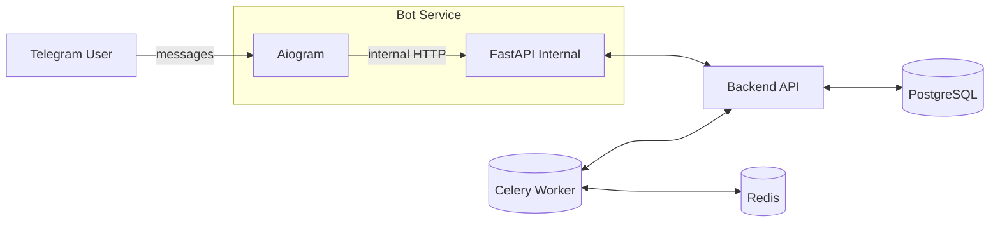

# Task Manager — Django + Telegram Bot 🎯🤖

Персональный менеджер задач с веб‑API на Django и Telegram‑ботом на Aiogram. Проект демонстрирует продакшн‑подходы: аутентификация через JWT, раздельные сервисы (backend + bot), Celery для фоновых задач, Docker Compose для быстрого старта.

<p align="left">
  
  
  
  
  
  
  
  
  
  
</p>

— Для найма: видно владение Django/DRF, интеграцией бота, аутентификацией, очередями и контейнерами на уровне Middle.  
— Для разработчиков: удобная основа под pet‑project/тестовое с реальным стеком.

---

## ✨ Основные возможности

- ⚙️ Backend: Django 5 + DRF + SimpleJWT (JWT‑аутентификация)
- 🤖 Бот: Aiogram 3 + FastAPI (внутренние маршруты и lifecycle)
- 🗃️ Данные: PostgreSQL (через Docker), Redis для Celery
- 🧵 Фон: Celery (уведомления по дедлайнам — контур заложен)
- 📦 Один шаг запуска: Docker Compose поднимает БД, backend и бота
- 🧭 Доменные сущности: Задачи, Категории, привязка пользователя к Telegram
- 🧩 Удобный UX в боте: пагинация, фильтры, защита от дублей/ошибок

---

## 🧱 Архитектура

Монорепозиторий из двух сервисов:

```
backend/   # Django + DRF API
bot/       # FastAPI + Aiogram (Telegram Bot)
```

Поток данных:
- Бот авторизуется во внутреннем эндпоинте `/api/v1/bot/auth` (заголовок `X-Internal-Token`)
- DRF выдаёт JWT (SimpleJWT); все REST‑вызовы — через Bearer‑токен
- Токены access/refresh кэшируются у бота локально (по `chat_id`)
- Celery‑воркер (опционально) шлёт напоминания через внутренние маршруты бота

Диаграмма:


---

## 📚 Доменная модель

- Task: id (snowflake), title, status (todo/in_progress/done), due_at, created_at, user, M2M categories
- Category: id (snowflake), name
- BotProfile: связь Django‑пользователя с Telegram (telegram_user_id, chat_id)

Пагинация: стандартная PageNumberPagination, размер страницы — 5.

---

## 🔌 API эндпоинты (основные)

- POST `/api/v1/bot/auth` — внутренняя авторизация бота (выдаёт JWT для TG‑пользователя), заголовок: `X-Internal-Token`
- GET `/api/v1/me` — профиль текущего пользователя
- `/api/v1/tasks/` — CRUD + фильтры: `status`, `category`, `due_before`, `due_after` (пагинация)
- `/api/v1/categories/` — CRUD (пагинация)

Примеры:
```bash
# Авторизация бота (внутренний вызов)
curl -X POST http://localhost:8000/api/v1/bot/auth \
  -H "X-Internal-Token: <internal-token>" \
  -d '{"telegram_user_id":123456,"chat_id":123456}'

# Текущий пользователь
curl -H "Authorization: Bearer <access>" http://localhost:8000/api/v1/me

# Задачи с фильтрами и пагинацией
curl -H "Authorization: Bearer <access>" \
  "http://localhost:8000/api/v1/tasks/?status=todo&category=work&due_before=2025-12-31&page=1"
```

---

## 🚀 Быстрый старт

Рекомендуемый путь — Docker Compose (поднимает PostgreSQL, Redis, backend и бота).

```bash
# сборка и запуск
docker compose up -d --build

# логи (при необходимости)
docker compose logs -f backend
docker compose logs -f bot
```

Минимальный набор переменных окружения (пример .env):
```env
# Backend
DJANGO_SECRET_KEY=changeme
DJANGO_DEBUG=True
DJANGO_ALLOWED_HOSTS=*

POSTGRES_DB=tasks
POSTGRES_USER=app
POSTGRES_PASSWORD=app
POSTGRES_HOST=db
POSTGRES_PORT=5432

REDIS_URL=redis://redis:6379/0

# JWT (SimpleJWT)
SIMPLEJWT_ACCESS_LIFETIME_MIN=30
SIMPLEJWT_REFRESH_LIFETIME_DAYS=7

# Bot
TELEGRAM_BOT_TOKEN=your-telegram-bot-token
INTERNAL_BOT_TOKEN=internal-shared-secret  # для X-Internal-Token
BACKEND_BASE_URL=http://backend:8000
```

Локальная разработка (вкратце):
```bash
# Backend
cd backend
python -m venv .venv && source .venv/bin/activate
pip install -r requirements.txt
python manage.py migrate
python manage.py createsuperuser
python manage.py runserver 0.0.0.0:8000

# Bot
cd ../bot
python -m venv .venv && source .venv/bin/activate
pip install -r requirements.txt
# Запуск FastAPI-приложения бота (пример команды)
uvicorn app:app --reload --host 0.0.0.0 --port 8001
```

> Примечание: точные имена модулей/команд для бота могут отличаться — ориентируйтесь на файлы внутри каталога `bot/` вашего репозитория.

---

## 🧪 Тесты и качество

- Тестирование: pytest (рекомендуется), httpx для API-тестов
- Статический анализ: ruff/mypy (опционально, при наличии конфигураций)
- Форматирование: black/isort (опционально)

Команды (пример):
```bash
pytest -q
ruff check .
mypy .
```

---

## 🗺️ Дорожная карта (пример)

- [ ] Уведомления о приближающихся дедлайнах через Celery
- [ ] Инлайн‑кнопки в боте для быстрого изменения статуса
- [ ] Экспорт/импорт задач (CSV/JSON)
- [ ] Ограничения на уровне ролей/пермишенов
- [ ] Rate limiting для внутренних эндпоинтов бота

---

## 🤝 Вклад

PR и предложения приветствуются:
1) Линтеры/тесты зелёные
2) Небольшие, атомарные изменения
3) Понятные описания коммитов/PR

---
